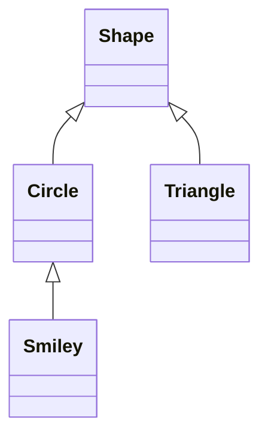

# C++是如何支持抽象和资源管理的

## Class

### Concrete Types
看起来就跟**内置类型一样**
典型的用户自定义类型如：
```cpp
class complex {
    double re, im;
public:
    complex(double r, double i) : re{r}, im{i} {}
    complex(double r) : re{r}, im{0} {}
    complex() : re{0}, im{0} {}
    ...
}
```

### Abstract Types
将使用者和实现细节完全隔离开来
```cpp
class Container {
public:
    // pure virtual function
    virtual double &operator[](int) = 0;
    virtual int size() const = 0;
    // virtual destructor function
    virtual ~Container() {}
};
```
关键字`virtual`意味着“可能随后在其派生类中重新定义”
如果一个虚函数后接着`= 0`说明此函数为**纯虚函数**
那么*含有纯虚函数的类称之为抽象类*
用法如下，`sample_use()`完全忽视`Container`的实现细节使用其接口`size()`和`[]`
```cpp
void sample_use(Container &c) {
    const int sz = c.size();
    for (int i = 0; i != sz; ++i)
        std::cout << c[i] << "\n";
}
```
可以使用一个容器类去实现该抽象类型接口所需的函数，如`Vector`
```cpp
class Vector_container : public Container {
    Vector v;
public:
    Vector_container(int s) : v(s) {}
    ~Vector_container() {}
    
    double &operator[](int i) { return v[i]; }
    int size() const { return v.size(); }
};
```
即该类型`Vector_container`派生（derived）自`Container`类，前者为子类（subclass），后者为超类（superclass），此种关联关系即为**继承（inheritance）**，对于`sample_use()`来说也可用于另一个继承了`Container`的类，比如
```cpp
class List_container : public Container {
    std::list<double> ld;
public:
    List_container() {}
    List_container(std::initializer_list<double> il) : ld{il} {}
    ~List_container() {}
    
    double &operator[](int i);
    int size() const { return ld.size(); }
};
```

### Virtual function
在`sample_use()`函数中`c[i]`是如何解析到正确的`operator[]()`的？如果`sample_use()`内使用的是`List_container`类型那么它必须调用`List_container`的`operator[]()`。
为了达到这种效果，我们使用**虚函数表（virtual function table）**，每个类型里都有`vtal`指针的位置以及每个虚函数对应的索引

### Class Hierarchies
通过派生（如`public`）创建的一组类在框架中有序排列，箭头表示继承关系

类层次提供**接口继承（Interface inheritance）**和**实现继承（Implementation inheritance）**

## Copy and Move
**拷贝对象在默认情况下是逐成员的复制**

### Copy Container
当一个类，作为**资源句柄（resource handle）**时，即这个类负责通过**指针**访问一个对象时，采用默认的逐个成员的复制方式是错误的，违反了**资源句柄的不变性**
比如有一个类`Vector`如下：
```cpp
class Vector {
private:
    double *elem;
    int size;
public:
    Vector(int s) : elem{new double[s]}, size{s} {
        for (int i = 0; i < size; ++i)
            elem[i] = 0;
    }
    ~Vector() { delete[] elem; }
    
    double &operator[](int i);
    int size() const;
};
```
当我们对其进行默认拷贝时：
```cpp
void bad_copy(Vector v1) {
    Vector v2 = v1;
    v1[0] = 2;
    v2[1] = 3;
    // now v1[1] = 3!
}
```
因为类`Vector`私有成员中包含一个指针类型，所以这段代码运行后`v[1]`的值将与`v2[1]`的相同，这类错误将会被编译器指出并产生警告（warning）
解决这类问题我们应当使用**拷贝构造函数（copy constructor）**和**拷贝复制运算符（copy assignment）**：
```cpp
class Vector {
private:
    double *elem;
    int size;
public:
    Vector(int s);
    ~Vector( delete[] elem; );

    // copy constructor
    Vector(const Vector &a);
    // copy assignment
    Vector &operator=(const Vector &a) : elem{ new double[size]; }, size{a.size} {
        for (int i = 0; i != size; ++i)
            elem[i] = 0;
    }
    
    ...
}
```